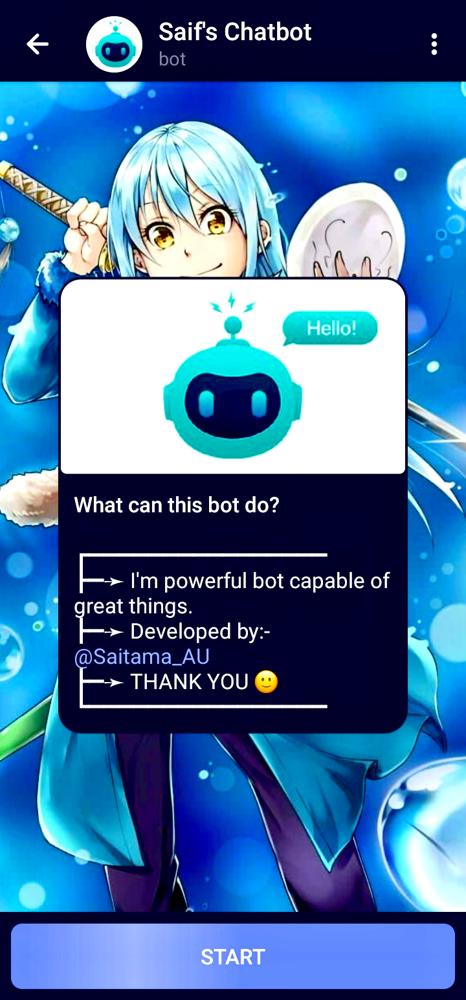

<h1 align="center">
  🤖🤖🤖
</h1>
<h1 align="center">
  SaifKhanAI Telegram Bot
</h1>

  <strong>Engage, Learn, and Laugh with Your AI-powered Telegram Companion</strong>

  <a href="#features">Features</a> •
  <a href="#deployment">Deployment</a> •
  <a href="#usage">Usage</a> •
  <a href="#contributing">Contributing</a> •
  <a href="#license">License</a>

  

---

"🚀 Unleash Chat Magic with SaifKhanAI Telegram Bot! Engage in dynamic chats, receive 🌟 quotes, fascinating facts, and hearty 😂 jokes. Powered by Python, Telegram API, and OpenAI. Effortlessly deployed on Render for instant interaction. 💬🤖"

---

## Features

- 🤖 Engage in interactive and dynamic chats using the `/talk` command.
- 🌟 Receive motivational and inspirational quotes with the `/quote` command.
- 🧠 Learn fascinating facts from a variety of topics using the `/fact` command.
- 😂 Get a dose of humor with random jokes and amusing messages using the `/joke` command.

---

## Deployment

Deploy your SaifKhanAI Telegram Bot effortlessly on [Render](https://render.com).
Just follow these steps:

1. Clone this repository: `git clone https://github.com/DarkHat28/SaifKhanAI_TGbot.git`
2. Set up environment variables (`TELEGRAM_TOKEN` and `OPENAI_API_KEY`) on Render.
3. Connect your repository to Render and follow the deployment prompts.

---

## Usage

1. Start a chat with the bot on Telegram: `@SaifKhanAI_TGbot`
2. Use the available commands to engage, learn, and have a good laugh.
3. Experiment and extend the bot's capabilities by modifying the code.

---

## Contributing

Contributions are welcome! If you'd like to contribute:
1. Fork this repository.
2. Create a new branch: `git checkout -b feature/my-feature`.
3. Commit your changes: `git commit -m 'Add some feature'`.
4. Push to the branch: `git push origin feature/my-feature`.
5. Open a pull request.

---

## Contact

Have questions or need assistance? Feel free to reach out to me:

- Telegram: [@Saitama_AU](https://t.me/Saitama_AU)

---

## License

This project is licensed under the [MIT License](https://github.com/DarkHat28/SaifKhanAI_TGbot/blob/main/LICENCE).
